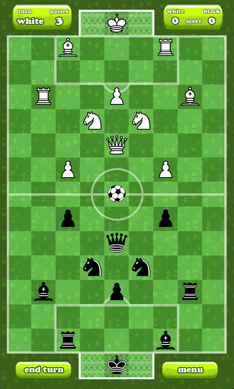
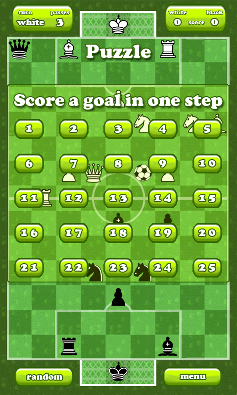
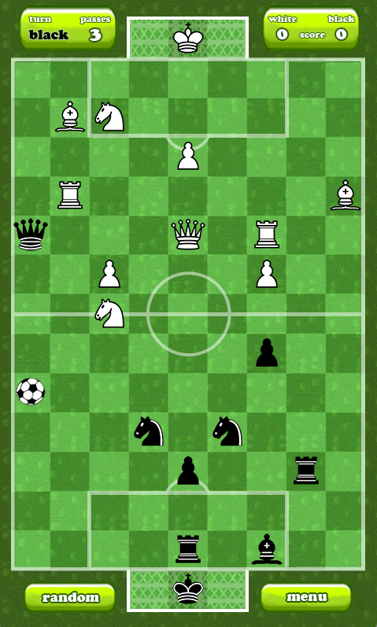

# ChessBall

> What if a chess match and a football match got into a fistfight, and the one
> that walked out the winner was *both of them at the same time*?

Welcome to **ChessBall** — a turn-based board game where chess pieces are
your team, the ball is the prize, and the back row is the goal. Knights pass.
Queens shoot. Pawns promote. The king runs for cover. And occasionally, you
just take the opposing queen because she walked into your bishop's diagonal.



That little ball in the middle? Yeah. **Get it into the other team's goal.**
Three times. Or, if you're feeling cheeky, just capture their king and call
it early. Your call.

---

## How it works (in 60 seconds)

The board is **9 wide × 15 tall**. Each side starts with a familiar lineup:

| Piece    | Count | Moves like…                                   |
|:---------|:-----:|:----------------------------------------------|
| King     |   1   | one square, any direction (he's precious)      |
| Queen    |   1   | any line, any distance — the playmaker         |
| Rook     |   2   | straight lines                                 |
| Bishop   |   2   | diagonals — surprisingly great for ball passes |
| Knight   |   2   | the L (and yes, knights can pass the ball too) |
| Pawn     |   4   | one square forward, promotes near the goal     |
| **Ball** |   1   | only moves when a friendly piece passes it     |

The goal cells are the three center columns of each back row (x = 3, 4, 5 at
y = 0 for white's goal, y = 14 for black's).

### A turn

Every turn you get a budget of **3 ball passes + 1 piece move**, in any order.
Mix and match:

- **Move** a piece like in chess (yes, captures work — and capturing the
  enemy king ends the game on the spot).
- **Pass** the ball: any friendly piece *standing next to the ball* can shoot
  it in that piece's movement pattern. Adjacent queen? The ball can fly any
  direction. Adjacent knight? The ball L-jumps. Adjacent bishop? Long
  diagonals open up.

Chain a knight pass into a queen-shaped rocket into a bishop diagonal, and
suddenly the ball is in the goal in a single turn. (The AI will absolutely
do this to you. Don't say we didn't warn you.)

### Winning

You win as soon as **either** of these happens:

- You score **3 goals** (default), **or**
- You **capture the opponent's king**.

Pawns auto-promote to queens when they reach row 13 (white) / row 1 (black).

---

## Modes

### 🎮 Play vs. the AI
Pick a difficulty and try not to lose your queen.



### 🧩 Puzzles
**25 hand-crafted puzzles**, each one a single position with the same
challenge: **"Score a goal in one turn."** No silly mate-in-five chess
puzzles here — just the *click* of finding the one knight-pass-then-queen-shot
combo that nobody else saw.



The puzzle index is laid out in a grid; once you crack a level it stays
ticked off so you know where to come back.

### 👥 Local 2-player
Hand the laptop back and forth like civilized humans.

---

## The AI is mean

ChessBall ships with three AI personalities, all built on the same core
engine: **iterative-deepening negamax with alpha–beta pruning**, plus a
move-ordering layer that runs static eval over every candidate so the
α-β cutoffs actually fire.

| Difficulty | Search depth | Defense lookahead | Personality                                           |
|:-----------|:------------:|:-----------------:|:------------------------------------------------------|
| **Easy**   |       1      |   40 ms × 4       | Sees one ply. Will sometimes play rank-2 or rank-3 just for variety. Plays the best move when the position is critical. |
| **Medium** |       2      |   60 ms × 5       | Sees your reply. Defends 1-move threats. Plays rank-2 only 5% of the time, never in critical positions. |
| **Hard**   |       3      |   1000 ms × ~10   | Negamax depth-3, exhaustive 4-action killer-sequence detection on the top candidates, material-weighted hanging-piece detection. **Defends like it has read your notes.** |

### What "defense lookahead" actually does

After picking the top candidates by score, every difficulty runs a final
sanity check on each one:

> *"If I make this move, can my opponent score (or capture my king) in their
> next single turn?"*

For Hard, that's an exhaustive search over **every** legal pass-pass-pass-move
ordering — up to 4 actions deep, with memoization so different orderings
that converge to the same board state aren't re-explored. Combined with a
material-weighted "is anything important hanging?" check (a dropped queen
costs 10 000 score points, a dropped knight 4 000), Hard will reliably
spot 4-action killer sequences and refuse to walk into them.

If that sounds like overkill for a casual game — well, *we agree*, but
players kept finding ways to score every turn against the easy heuristics.
So now the AI tries.

---

## Tech stack

| Thing            | What we use                                            |
|:-----------------|:-------------------------------------------------------|
| Engine           | [libGDX](https://libgdx.com/) **1.14.0**               |
| Language         | **Java 17**                                            |
| Desktop          | LWJGL3                                                 |
| Web              | [gdx-teavm](https://github.com/xpenatan/gdx-teavm) **1.5.3** (replaces GWT — TeaVM compiles Java to JS) |
| Android          | Standard libGDX Android module + Gradle 8.x           |
| Backend (demos)  | PHP 5.3 + PDO/MySQL — see [`php/`](php/)               |
| Build            | Gradle wrapper (8.13)                                  |

Multi-module layout, the standard libGDX way:

```
chessball/
├── core/         ← all game logic (board, AI, screens, rendering)
├── desktop/      ← LWJGL3 launcher
├── android/      ← Android launcher + manifest
├── teavm/        ← TeaVM web build
├── assets/       ← shared sprites, fonts, sounds
├── php/          ← optional server-side demo storage
└── screenshots/  ← (the pretty pictures above)
```

---

## Build & run

### Desktop
```bash
./gradlew :desktop:run
```

### Android
```bash
./gradlew :android:installDebug
```
…or just open the project in Android Studio and hit ▶.

### Web (TeaVM)
```bash
./gradlew :teavm:run
```
Then open `http://localhost:8080` in any modern browser.

### Anything else
```bash
./gradlew tasks
```
will show the rest.

---

## Project layout (the parts you'll actually edit)

```
core/src/com/apogames/chessball/
├── ChessBall.java                      ← libGDX game entry point
├── Constants.java                      ← board size, colors, i18n strings
├── ai/
│   ├── Easy.java / Medium.java / Hard.java
│   ├── You.java                        ← human-input adapter
│   └── algo/
│       ├── AlphaBetaAI.java            ← negamax + α-β core
│       ├── TurnGenerator.java          ← move generation + scoring DFS
│       └── Evaluator.java              ← static eval (material, ball progress, shot threat, …)
├── game/
│   ├── ChessBallBoard.java             ← board state + rules
│   ├── game/ChessBallGame.java         ← gameplay screen
│   ├── menu/ChessBallMenu.java         ← main menu
│   ├── puzzle/                         ← puzzle screen + the 25 levels
│   └── enums/                          ← ChessBallFigure (the 0-13 fieldValue encoding)
└── asset/                              ← sprite/font loaders
```

---

## Hotkeys (in-game)

| Key | Effect                                                            |
|:---:|:------------------------------------------------------------------|
| **F2** | Toggle a debug overlay that prints `(x, y)` on every board cell. Useful when you're trying to explain to the AI exactly which square you mean. |

---

## License

MIT — see [`LICENSE`](LICENSE).

Built by [TheApo](https://github.com/TheApo) (Dirk Aporius), 2026.

Now go score a goal in one turn. ⚽♟️
